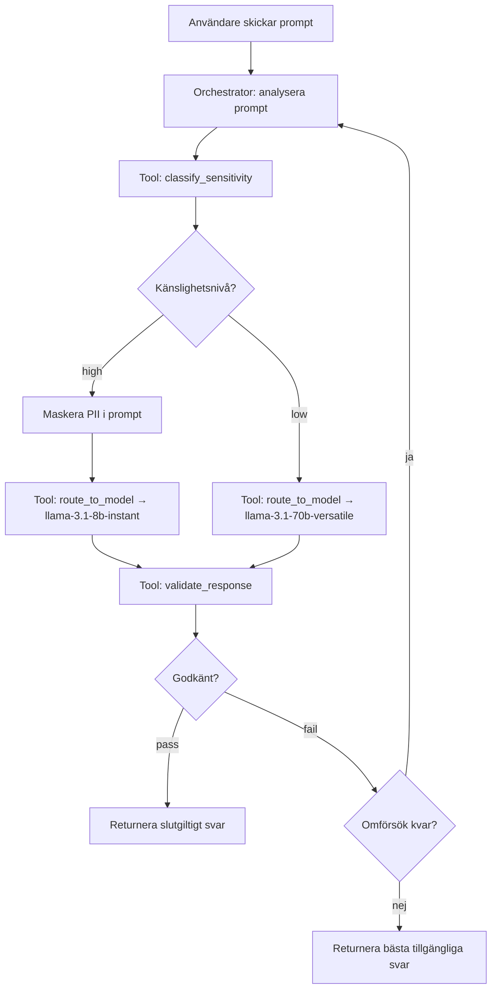

# Prompt Sensitivity Router

Ett agentiskt arbetsflöde som klassificerar användarpromptar efter känslig data (PII), maskerar detekterad PII innan vidarebefordran, dirigerar promptar till en lämplig modell baserat på känslighetsnivå, validerar svar och hanterar omförsök och fallbacks.

Grupp 6: Abdulla Mehdi, Caroline Swanpalmer, Johanna Gull

Byggt för Lab 2 (Agentiska arbetsflöden) i kursen *Tillämpning av AI-agenter i Unity* vid Högskolan i Borås.

## Innehållsförteckning

- [Uppgiftsdefinition](#uppgiftsdefinition)
- [Arbetsflödesarkitektur](#arbetsflödesarkitektur)
- [Verktygsbeskrivningar](#verktygsbeskrivningar)
- [Agentisk loop — Planera, Agera, Observera, Reflektera, Revidera](#agentisk-loop)
- [Tillståndshantering](#tillståndshantering)
- [Utvärderingsresultat](#utvärderingsresultat)
- [Begränsningar, fellägen och åtgärder](#begränsningar-fellägen-och-åtgärder)
- [Installation och reproducerbarhet](#installation-och-reproducerbarhet)
- [Teknikstack](#teknikstack)
- [Filstruktur](#filstruktur)

---

## Uppgiftsdefinition

**Mål:** Givet en godtycklig användarprompt, avgöra om den innehåller personligt identifierbar information (PII), dirigera den till en lämplig modell baserat på känslighetsnivån och returnera ett validerat svar.

**Input:** En naturlig-språklig prompt från en användare, som kan innehålla PII såsom personnummer, e-postadresser, telefonnummer, kreditkortsnummer eller känsliga nyckelord (medicinska, finansiella m.m.).

**Åtgärder agenten kan utföra:**
- Anropa `classify_sensitivity` för att detektera PII i prompten
- Maskera detekterad PII med säkra platshållare innan routing
- Anropa `route_to_model` för att skicka den (maskerade) prompten till en lämplig modell
- Anropa `validate_response` för att kontrollera svarskvalitet och PII-läckage
- Returnera ett slutgiltigt svar med en routing-sammanfattning

**Miljödynamik:** Varje tool-anrop returnerar strukturerade resultat som läggs till i agentens trajectory. Agenten ser den fullständiga historiken av sina åtgärder och deras utfall när den bestämmer nästa steg.

**Framgångskriterier:** Prompten dirigeras till rätt modell baserat på sin känslighetsnivå och svaret passerar validering (icke-tomt, tillräcklig längd, ingen PII-läckage).

**Felkriterier:** Prompten dirigeras till fel modell, PII läcker in i svaret, eller agenten misslyckas med att producera ett slutgiltigt svar inom steg-gränsen.

**Begränsningar:** Maximalt 10 steg per prompt. Maximalt 2 omförsök vid misslyckad validering.

---

## Arbetsflödesarkitektur

```
┌─────────────────────────────────────────────────────────┐
│                      agent.py                           │
│                   (Controller Loop)                     │
│                                                         │
│  ┌───────────────────────────────────────────────────┐  │
│  │           Orchestrator LLM (Groq)                 │  │
│  │         llama-3.1-8b-instant                      │  │
│  │                                                   │  │
│  │  Sees: prompt + trajectory + step + next hint     │  │
│  │  Decides: which tool to call next                 │  │
│  │  Stops: when "final" or max_steps reached         │  │
│  └────────────────────┬──────────────────────────────┘  │
│                       |                                 │
│        ┌──────────────┼─────────────────┐               │
│        ▼              ▼                 ▼               │
│  ┌───────────┐ ┌─────────────┐ ┌──────────────────┐     │
│  │ classify_ │ │   route     │ │    validate      │     │
│  │sensitivity│ │ _to_model   │ │   _response      │     │
│  │           │ │             │ │                  │     │
│  │ Pure code │ │ Groq API    │ │ Pure code        │     │
│  │ Regex/KW  │ │ call        │ │ String checks    │     │
│  └───────────┘ └─────────────┘ └──────────────────┘     │
│                                                         │
│                    tools.py                             │
└─────────────────────────────────────────────────────────┘
```



Systemet har tre lager: orchestrator-LLM:en (som fattar beslut), tre verktyg (som utför åtgärder) och controller-loopen (som binder ihop allt, applicerar PII-maskning innan routing och upprätthåller säkerhetsbegränsningar).

---

## Verktygsbeskrivningar

### classify_sensitivity (Ren Python — ingen LLM)

Analyserar prompten efter PII med hjälp av regex-mönstermatchning och nyckelordsdetektering. Returnerar en känslighetsnivå ("high" eller "low") samt en lista över vad som matchade. Mönster inkluderar svenska personnummer, e-postadresser, telefonnummer, kreditkortsnummer och IP-adresser. Nyckelord täcker medicinska, finansiella och identitetsrelaterade termer.

Detta verktyg är medvetet regelbaserat, inte LLM-baserat. Om en moln-LLM användes för att klassificera känslig data hade datan redan lämnat den säkra miljön innan routingbeslutet fattas — vilket motverkar hela syftet med routern.

### route_to_model (Groq API-anrop)

Tar prompten och dess känslighetsnivå och skickar den till lämplig modell. För prompts med hög känslighet ersätts först detekterad PII med säkra platshållare (`[EMAIL]`, `[PERSONNUMMER]`, `[TELEFONNUMMER]` m.fl.) så att modellen aldrig ser den faktiska känsliga datan. Prompts med hög känslighet skickas till `llama-3.1-8b-instant` (representerar en säker/lokal modell), medan prompts med låg känslighet skickas till `llama-3.1-70b-versatile` (representerar en molnmodell). Båda körs via Groqs API i denna prototyp, men routinglogiken är densamma som i en riktig lokal/moln-uppdelning.

Maskeringen appliceras i controller-loopen (`agent.py`) innan verktyget anropas. Det innebär att `classify_sensitivity` ser den råa prompten (den behöver detektera PII), `route_to_model` ser den maskerade prompten (modellen ska aldrig se PII) och `validate_response` kontrollerar mot den råa prompten (för att fånga eventuell läckage).

### validate_response (Ren Python — ingen LLM)

Kontrollerar modellens svar mot tre kriterier: det får inte vara tomt, det måste ha tillräcklig längd (minst 10 tecken) och det får inte innehålla PII från den ursprungliga prompten (detekteras via samma regex-mönster som används vid klassificering). Returnerar "pass" eller "fail" med motivering.

### Varför verktyg behövs

Utan verktyg hade systemet varit ett enskilt prompt-in/svar-ut-anrop — ingen klassificering, ingen routing, ingen validering. Verktygen ger den miljöåterkoppling som gör agentloopen meningsfull. Klassificeringsverktyget är nödvändigt eftersom det bestämmer routingvägen. Valideringsverktyget är nödvändigt eftersom det ger återkopplingssignalen för iteration.

---

## Agentisk loop

Controller-loopen i `agent.py` följer mönstret planera → agera → observera → reflektera → revidera:

**Planera:** Orchestrator-LLM:en tar emot aktuellt tillstånd (användarprompt, trajectory med tidigare åtgärder, stegräknare och en dynamisk "next hint") och bestämmer vad den ska göra härnäst.

**Agera:** Loopen skickar LLM:ens valda åtgärd — anropar lämpligt verktyg med angivna argument.

**Observera:** Verktygets resultat läggs till i trajectory. Vid nästa iteration ser LLM:en den fullständiga historiken av åtgärder och resultat.

**Reflektera:** LLM:en läser den uppdaterade trajectory:n och next hint (härledd från vad som hänt hittills) och utvärderar om uppgiften är slutförd.

**Revidera:** Om validering misslyckades kan LLM:en ändra strategi — försöka med samma modell igen, prova en annan modell eller ge upp efter max antal omförsök.

### Happy path (4 steg)

classify → route → validate (pass) → final

### Retry path (6–8 steg)

classify → route → validate (fail) → route (omförsök) → validate → ... → final

Med PII-maskning elimineras valideringsfel orsakade av PII-läckage i stort sett helt. Omförsök hanterar nu främst edge cases som tomma eller för korta svar.

### Max omförsök uttömda

Om validering misslyckas 3 gånger avslutar controller-loopen automatiskt och returnerar det bästa tillgängliga svaret med `validation_status: "fail"` i routing-sammanfattningen.

### Designbeslut

Orchestratorn använder `llama-3.1-8b-instant` med `temperature=0` för deterministiskt beteende. En dynamisk `_derive_next_hint()`-funktion ger explicit vägledning till LLM:en vid varje steg, vilket var nödvändigt eftersom 8B-modellen hade svårt att härleda nästa steg enbart från trajectory. Detta håller arkitekturen agentisk (LLM:en fattar fortfarande beslutet) samtidigt som den får tillräcklig vägledning för pålitlig exekvering.

---

## Tillståndshantering

Tillstånd representeras som en trajectory — en lista med dictionaries, en per steg, som registrerar vilken åtgärd som utfördes, vilket verktyg som anropades, vilken input som gavs och vilket resultat som erhölls. Den fullständiga trajectory:n skickas till orchestrator-LLM:en vid varje iteration, vilket ger den full insyn i vad som har hänt.

För att hantera kontextfönstrets begränsningar trunkerar funktionen `_compact_trajectory()` stora modellsvar (från `route_to_model`) till 300 tecken i LLM:ens vy. De fullständiga svaren bevaras internt för användning av valideringsverktyget och det slutgiltiga svaret.

---

## Utvärderingsresultat

### Routingprecision: 20/20 (100%)

Alla 20 promptar klassificerades korrekt och dirigerades till rätt modell.

| Kategori | Totalt | Korrekta | Precision |
|----------|--------|----------|-----------|
| Hög känslighet (PII) | 10 | 10 | 100% |
| Låg känslighet (ingen PII) | 10 | 10 | 100% |
| **Totalt** | **20** | **20** | **100%** |

### Validering: 20/20 (100%)

Alla 20 promptar passerade validering. Genomsnittligt antal steg per prompt: ~4,2.

### End-to-end-verifierade tester

| Prompt | Nivå | Modell | Validering | Steg |
|--------|------|--------|------------|------|
| Personnummer | high | llama-3.1-8b-instant | pass | 4 |
| E-postadress | high | llama-3.1-8b-instant | pass | 4 |
| Telefonnummer | high | llama-3.1-8b-instant | pass | 4 |
| Kreditkortsnummer | high | llama-3.1-8b-instant | pass | 4 |
| Hemadress (nyckelord) | high | llama-3.1-8b-instant | pass | 4–6 |
| Lön (nyckelord) | high | llama-3.1-8b-instant | pass | 4 |
| Medicinsk diagnos (nyckelord) | high | llama-3.1-8b-instant | pass | 4 |
| Lösenord (nyckelord) | high | llama-3.1-8b-instant | pass | 4 |
| E-post + telefon kombinerat | high | llama-3.1-8b-instant | pass | 4 |
| Hemadress (nyckelord) | high | llama-3.1-8b-instant | pass | 4 |
| Enkel faktafråga | low | llama-3.1-70b-versatile | pass | 4 |
| Utbildningsfråga | low | llama-3.1-70b-versatile | pass | 4 |
| Kreativ förfrågan | low | llama-3.1-70b-versatile | pass | 4 |
| Teknisk jämförelse | low | llama-3.1-70b-versatile | pass | 4 |
| Matlagningsfråga | low | llama-3.1-70b-versatile | pass | 4 |
| Historisk sammanfattning | low | llama-3.1-70b-versatile | pass | 4 |
| Datavetenskapsfråga | low | llama-3.1-70b-versatile | pass | 4 |
| Arkitekturfråga | low | llama-3.1-70b-versatile | pass | 4 |
| Bokförslag | low | llama-3.1-70b-versatile | pass | 4 |
| Matematisk formel | low | llama-3.1-70b-versatile | pass | 4 |

### Effekt av PII-maskning

Testfallet med e-postadress demonstrerar effekten av PII-maskning:

| | Utan maskning | Med maskning |
|---|------|-------|
| Vad modellen ser | `anna.svensson@gmail.com` | `[EMAIL]` |
| Modellens svar nämner | E-postadressen bokstavligt | "den angivna e-postadressen" |
| Validering | fail (PII läckte) → omförsök → fail | pass |
| Steg | 7 (max omförsök uttömda) | 4 |

### Baseline-jämförelse

Baseline: alla promptar skickas till samma modell (`llama-3.1-70b-versatile`) utan klassificering, maskning eller validering.

Baselinen har ingen routingmedvetenhet — varje prompt, oavsett känslighet, skickas till "moln"-modellen. Den har heller inget PII-maskerings- eller valideringssteg, vilket innebär att känslig data skickas till modellen i klartext och eventuell PII-läckage i svar passerar oupptäckt. Det agentiska arbetsflödet förhindrar detta genom att maskera PII innan routing och validera svar efteråt.

---

## Begränsningar, fellägen och åtgärder

### Begränsningar

- **Nyckelordsbaserad klassificering** kan inte detektera implicit PII (t.ex. en gatuadress utan ordet "adress"). Mer sofistikerade metoder (NER-modeller, mönsterinlärning) skulle förbättra recall.
- **Båda modellerna körs via samma API** (Groq). I produktion skulle den "säkra" modellen vara en lokalt hostad modell utan extern nätverksåtkomst.
- **PII-maskning är regex-baserad** och maskerar bara mönster som är explicit definierade. PII uttryckt i ovanliga format eller naturligt språk (t.ex. "mitt födelsedatum är femte maj nittonnittiofem") skulle inte maskeras.
- **8B orchestrator-modellen** kräver explicit steg-för-steg-vägledning (`_derive_next_hint`) för att pålitligt följa pipelinen. En större modell skulle behöva mindre handledning.

### Fellägen och åtgärder

| Felläge | Åtgärd |
|---|---|
| LLM returnerar ogiltig JSON | Markdown-kodblockstrippning + JSON-fallback som härleder nästa åtgärd från pipeline-position |
| LLM trunkerar modellsvar i JSON-output | `validate_response` fyller automatiskt i argument från lagrad trajectory istället för att förlita sig på LLM:ens eko |
| PII läcker in i modellsvar | PII-maskning ersätter känslig data med platshållare innan prompten når modellen |
| Validering misslyckas upprepade gånger | Automatisk avslutning efter 3 routingförsök, returnerar bästa tillgängliga svar med `validation_status: "fail"` |
| Okänt verktygnamn | Loggas som fel i trajectory, loopen fortsätter |
| LLM hoppar över klassificeringssteget | Systemprompt och next-hint-mekanismen upprätthåller korrekt ordning |

---

## Installation och reproducerbarhet

### Förutsättningar

- Python 3.10+
- En Groq API-nyckel (https://console.groq.com)

### Installation

```bash
git clone https://github.com/Abdriano95/c1tai1-lab2-prompt-router.git
cd c1tai1-lab2-prompt-router
python -m venv venv

# Windows PowerShell:
.\venv\Scripts\Activate.ps1
# Mac/Linux:
# source venv/bin/activate

pip install -r requirements.txt
```

### Konfiguration

Skapa en `.env`-fil i projektets rot:

```
GROQ_API_KEY=din-nyckel-här
```

### Kör en enskild prompt

```bash
python agent.py
```

Kör en prompt end-to-end och skriver ut hela spåret: varje stegs åtgärd, tool-anrop, resultat, valideringsutfall och slutgiltigt svar.

### Kör utvärdering

```bash
python evaluate.py
```

Kör alla 20 testpromptar genom agenten och baselinen, och sparar sedan resultaten till `evaluation_results.json`.

---

## Teknikstack

- **Python** med `langchain` och `langchain-groq`
- **Groq API** — `llama-3.1-8b-instant` (orchestrator + säker modell), `llama-3.1-70b-versatile` (molnmodell)
- **python-dotenv** för hantering av miljövariabler

---

## Filstruktur

```
c1tai1-lab2-prompt-router/
├── .vscode/              # VS Code-inställningar
├── tests/
│   ├── test_tools.py     # Enhetstester för verktyg
│   └── test.py           # Allmänna tester
├── .env                  # API-nyckel (ej commitad)
├── .gitignore
├── agent.py              # Controller-loop + huvudingång
├── evaluate.py           # Utvärderingsscript (agent + baseline)
├── LICENSE
├── prompts.py            # Systemprompt + testpromptar
├── README.md             # Denna fil
├── requirements.txt      # Python-dependencies
└── tools.py              # classify_sensitivity, route_to_model, validate_response
```
