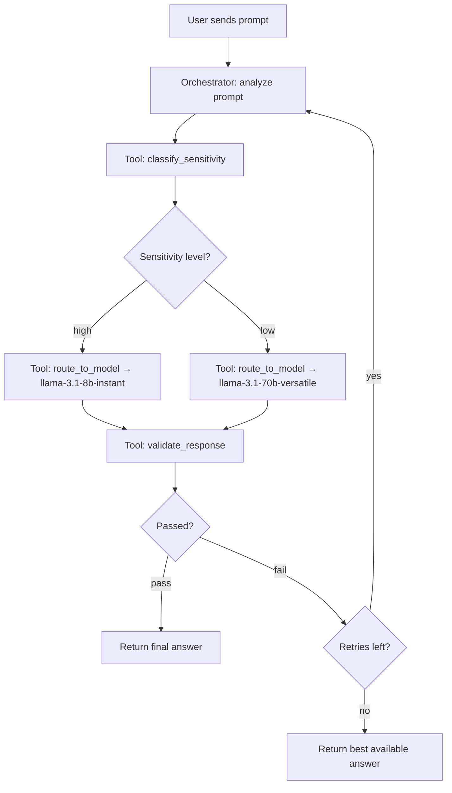

# Prompt Sensitivity Router

An agentic workflow that classifies user prompts for sensitive data (PII), routes them to an appropriate model based on sensitivity level, validates responses, and handles retries and fallbacks.

Built for Lab 2 (Agentic Workflows) in the course *Tillämpning av AI-agenter i Unity* at University of Borås.

## Table of Contents

- [Task Definition](#task-definition)
- [Workflow Architecture](#workflow-architecture)
- [Tool Descriptions](#tool-descriptions)
- [Agentic Loop — Plan, Act, Observe, Reflect, Revise](#agentic-loop)
- [State Handling](#state-handling)
- [Evaluation Results](#evaluation-results)
- [Limitations, Failure Modes, and Mitigations](#limitations-failure-modes-and-mitigations)
- [Setup and Reproducibility](#setup-and-reproducibility)
- [Tech Stack](#tech-stack)
- [File Structure](#file-structure)

---

## Task Definition

**Goal:** Given an arbitrary user prompt, determine whether it contains personally identifiable information (PII), route it to an appropriate model based on the sensitivity level, and return a validated response.

**Inputs:** A natural language prompt from a user, which may or may not contain PII such as personal identity numbers, email addresses, phone numbers, credit card numbers, or sensitive keywords (medical, financial, etc.).

**Actions the agent can take:**
- Call `classify_sensitivity` to detect PII in the prompt
- Call `route_to_model` to send the prompt to an appropriate model
- Call `validate_response` to check response quality and PII leakage
- Return a final answer with a routing summary

**Environment dynamics:** Each tool call returns structured results that are appended to the agent's trajectory. The agent sees the full history of its actions and their outcomes when deciding the next step.

**Success criteria:** The prompt is routed to the correct model based on its sensitivity level, and the response passes validation (non-empty, sufficient length, no PII leakage).

**Failure criteria:** The prompt is routed to the wrong model, PII leaks into the response, or the agent fails to produce a final answer within the step limit.

**Constraints:** Maximum 10 steps per prompt. Maximum 2 retries on failed validation. Groq API free tier rate limits (6000 tokens/minute).

---

## Workflow Architecture

```
┌─────────────────────────────────────────────────────────┐
│                      agent.py                           │
│                   (Controller Loop)                     │
│                                                         │
│  ┌───────────────────────────────────────────────────┐  │
│  │           Orchestrator LLM (Groq)                 │  │
│  │         llama-3.1-8b-instant                      │  │
│  │                                                   │  │
│  │  Sees: prompt + trajectory + step + next hint     │  │
│  │  Decides: which tool to call next                 │  │
│  │  Stops: when "final" or max_steps reached         │  │
│  └───────────────┬───────────────────────────────────┘  │
│                   │                                     │
│          ┌────────┼────────┐                            │
│          ▼        ▼        ▼                            │
│  ┌───────────┐ ┌─────────────┐ ┌──────────────────┐    │
│  │ classify  │ │   route     │ │    validate      │    │
│  │_sensitivity│ │ _to_model  │ │   _response      │    │
│  │           │ │             │ │                   │    │
│  │ Pure code │ │ Groq API   │ │ Pure code         │    │
│  │ Regex/KW  │ │ call       │ │ String checks     │    │
│  └───────────┘ └─────────────┘ └──────────────────┘    │
│                                                         │
│                    tools.py                              │
└─────────────────────────────────────────────────────────┘
```



The system has three layers: the orchestrator LLM (which makes decisions), three tools (which perform actions), and the controller loop (which ties everything together and enforces safety constraints).

---

## Tool Descriptions

### classify_sensitivity (Pure Python — no LLM)

Analyzes the prompt for PII using regex pattern matching and keyword detection. Returns a sensitivity level ("high" or "low") and a list of what matched. Patterns include Swedish personal identity numbers, email addresses, phone numbers, credit card numbers, and IP addresses. Keywords cover medical, financial, and identity-related terms.

This tool is deliberately rule-based, not LLM-based. If a cloud LLM were used to classify sensitive data, the data would already have left the secure environment before the routing decision is made — defeating the purpose of the router.

### route_to_model (Groq API call)

Takes the prompt and its sensitivity level, then sends it to the appropriate model. High sensitivity prompts go to `llama-3.1-8b-instant` (representing a secure/local model), while low sensitivity prompts go to `llama-3.1-70b-versatile` (representing a cloud model). Both run on Groq's API in this prototype, but the routing logic is the same as in a real local/cloud split.

### validate_response (Pure Python — no LLM)

Checks the model's response against three criteria: it must not be empty, it must have sufficient length (minimum 10 characters), and it must not contain PII from the original prompt (detected via the same regex patterns used in classification). Returns "pass" or "fail" with a reason.

### Why tools are needed

Without tools, the system would be a single prompt-in/response-out call — no classification, no routing, no validation. The tools provide the environmental feedback that makes the agent loop meaningful. The classification tool is essential because it determines the routing path. The validation tool is essential because it provides the feedback signal for iteration.

---

## Agentic Loop

The controller loop in `agent.py` follows the plan → act → observe → reflect → revise pattern:

**Plan:** The orchestrator LLM receives the current state (user prompt, trajectory of past actions, step count, and a dynamic "next hint") and decides what to do next.

**Act:** The loop dispatches the LLM's chosen action — calling the appropriate tool with the specified arguments.

**Observe:** The tool result is appended to the trajectory. On the next iteration, the LLM sees the full history of actions and results.

**Reflect:** The LLM reads the updated trajectory and the next hint (derived from what has happened so far) and evaluates whether the task is complete.

**Revise:** If validation failed, the LLM can change strategy — retry the same model, try a different model, or give up after max retries.

### Happy path (4 steps)

classify → route → validate (pass) → final

### Retry path (6–8 steps)

classify → route → validate (fail: PII leaked) → route (retry) → validate → ... → final

### Max retries exhausted

If validation fails 3 times, the controller loop auto-terminates and returns the best available answer with `validation_status: "fail"` in the routing summary.

### Design decisions

The orchestrator uses `llama-3.1-8b-instant` with `temperature=0` for deterministic behavior. A dynamic `_derive_next_hint()` function provides explicit guidance to the LLM at each step, which was necessary because the 8B model struggled to infer next steps from trajectory alone. This keeps the architecture agentic (the LLM still makes the decision) while providing sufficient guidance for reliable execution.

---

## State Handling

State is represented as a trajectory — a list of dictionaries, one per step, recording the action taken, tool called, input provided, and result received. The full trajectory is passed to the orchestrator LLM on each iteration, giving it complete visibility into what has happened.

To manage context window limits, a `_compact_trajectory()` function truncates large model responses (from `route_to_model`) to 300 characters in the LLM's view. The full responses are preserved internally for use by the validation tool and the final answer.

---

## Evaluation Results

### Routing Accuracy: 17/20 (85%)

All 10 low-sensitivity prompts were correctly routed (100%). 7 of 10 high-sensitivity prompts were correctly routed (70%).

| Category | Total | Correct | Accuracy |
|----------|-------|---------|----------|
| High sensitivity (PII) | 10 | 7 | 70% |
| Low sensitivity (no PII) | 10 | 10 | 100% |
| **Overall** | **20** | **17** | **85%** |

### End-to-End Verified Tests

| Prompt | Level | Model | Validation | Steps |
|--------|-------|-------|------------|-------|
| Personal identity number | high | llama-3.1-8b-instant | pass | 4 |
| Email address | high | llama-3.1-8b-instant | pass (after retries) | 8 |
| Phone number | high | llama-3.1-8b-instant | pass | 4 |
| Credit card number | high | llama-3.1-8b-instant | pass | 4 |
| "Capital of France?" | low | llama-3.1-70b-versatile | pass | 4 |
| "Write a poem about the sea" | low | llama-3.1-70b-versatile | pass | 4 |

### Baseline Comparison

Baseline: all prompts sent to the same model (`llama-3.1-70b-versatile`) without classification or validation.

The baseline has no routing awareness — every prompt, regardless of sensitivity, is sent to the "cloud" model. It also has no validation step, meaning PII that leaks into responses goes undetected. The agentic workflow catches and retries these cases (demonstrated by the email address test taking 8 steps with retries).

### Analysis of the 3 Misclassifications

All three misses were caused by gaps in the keyword list in `tools.py`, not by agent logic:

- "Jag bor på Storgatan 14..." — contains an implicit street address but not the keyword "adress"
- "Min lön är 45000 kr..." — the word "lön" was missing from the keyword list
- "Jag har fått diagnosen diabetes typ 2..." — "diagnos" and "diabetes" were missing from the keyword list

These are addressable by expanding the keyword list and do not indicate architectural problems.

---

## Limitations, Failure Modes, and Mitigations

### Limitations

- **Keyword-based classification** cannot detect implicit PII (e.g., a street address without the word "address"). More sophisticated approaches (NER models, pattern learning) would improve recall.
- **Both models run on the same API** (Groq). In production, the "secure" model would be a locally hosted model with no external network access.
- **Groq free tier rate limits** (6000 tokens/minute) constrain evaluation speed and make full 20-prompt runs slow.
- **8B orchestrator model** requires explicit step-by-step guidance (`_derive_next_hint`) to reliably follow the pipeline. A larger model would need less hand-holding.

### Failure Modes and Mitigations

| Failure mode | Mitigation |
|---|---|
| LLM returns invalid JSON | Markdown code-block stripping + JSON fallback that infers next action from pipeline position |
| LLM truncates model response in JSON output | `validate_response` auto-fills arguments from stored trajectory instead of relying on LLM echo |
| Rate limit exceeded (HTTP 429) | Exponential backoff retry (10s, 20s, 30s) + 2s pause between steps |
| Validation fails repeatedly | Auto-terminate after 3 route attempts, return best available answer with `validation_status: "fail"` |
| Unknown tool name | Logged as error in trajectory, loop continues |
| LLM skips classification step | System prompt and next-hint mechanism enforce correct ordering |

---

## Setup and Reproducibility

### Prerequisites

- Python 3.10+
- A Groq API key (free at https://console.groq.com)

### Installation

```bash
git clone https://github.com/Abdriano95/c1tai1-lab2-prompt-router.git
cd c1tai1-lab2-prompt-router
python -m venv venv

# Windows PowerShell:
.\venv\Scripts\Activate.ps1
# Mac/Linux:
# source venv/bin/activate

pip install -r requirements.txt
```

### Configuration

Create a `.env` file in the project root:

```
GROQ_API_KEY=your-key-here
```

### Run a Single Prompt

```bash
python agent.py
```

This runs one prompt end-to-end and prints the full trace: each step's action, tool calls, results, validation outcome, and final answer.

### Run Evaluation

```bash
python evaluate.py
```

Runs all 20 test prompts through the agent and the baseline, then saves results to `evaluation_results.json`. Note: due to Groq free tier rate limits, this takes several minutes with pauses between tests.

---

## Tech Stack

- **Python** with `langchain` and `langchain-groq`
- **Groq API** (free tier) — `llama-3.1-8b-instant` (orchestrator + secure model), `llama-3.1-70b-versatile` (cloud model)
- **python-dotenv** for environment variable management

---

## File Structure

```
c1tai1-lab2-prompt-router/
├── .vscode/              # VS Code settings
├── tests/
│   ├── test_tools.py     # Tool unit tests
│   └── test.py           # General tests
├── .env                  # API key (not committed)
├── .gitignore
├── agent.py              # Controller loop + main entrypoint
├── evaluate.py           # Evaluation script (agent + baseline)
├── LICENSE
├── prompts.py            # System prompt + test prompts
├── README.md             # This file
├── requirements.txt      # Python dependencies
└── tools.py              # classify_sensitivity, route_to_model, validate_response
```

============================================================
EVALUATION: Running agent on all test prompts
============================================================


============================================================
EVALUATION RESULTS
============================================================
Total prompts:      20
Routing accuracy:   20/20 (100.0%)
Validation passes:  19/20 (95.0%)
Avg steps/prompt:   4.2


============================================================
BASELINE: All prompts → same model, no classification
============================================================
Test 1: pass | 0.67s
Test 2: fail | 0.72s
Test 3: pass | 0.21s
Test 4: pass | 0.42s
Test 5: fail | 0.69s
Test 6: pass | 0.83s
Test 7: pass | 1.04s
Test 8: pass | 0.71s
Test 9: fail | 0.35s
Test 10: pass | 0.46s
Test 11: pass | 0.05s
Test 12: pass | 0.94s
Test 13: pass | 0.30s
Test 14: pass | 1.24s
Test 15: pass | 1.18s
Test 16: pass | 0.58s
Test 17: pass | 1.43s
Test 18: pass | 1.12s
Test 19: pass | 0.62s
Test 20: pass | 0.21s

Baseline PII leaks: 0/20

Results saved to evaluation_results.json