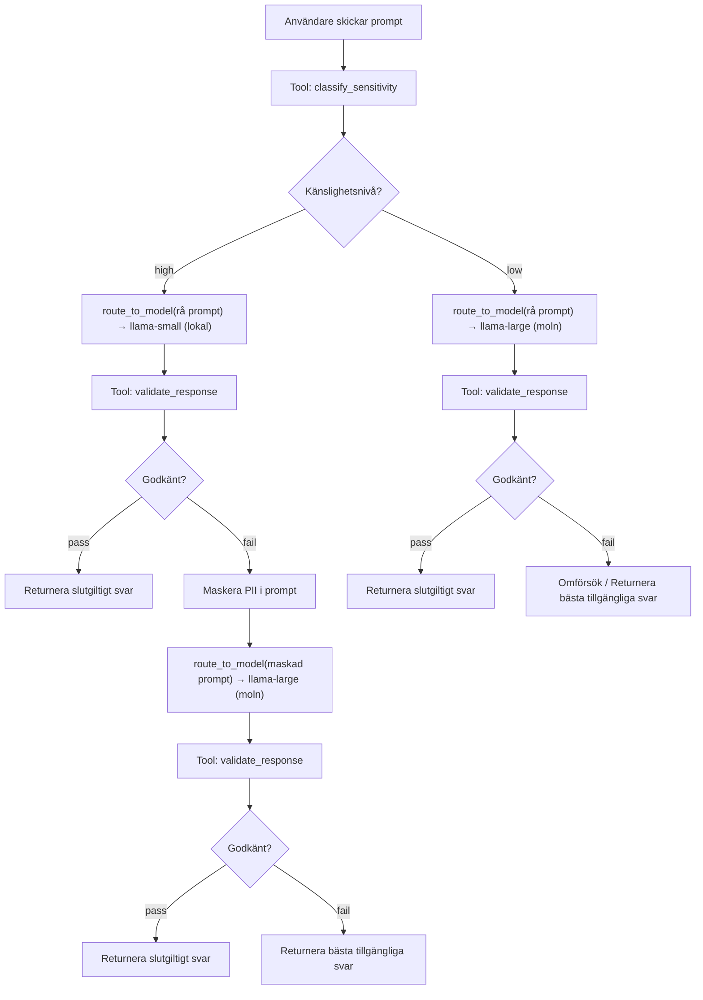

# Prompt Sensitivity Router

Ett agentiskt arbetsflöde som klassificerar användarpromptar efter känslig data (PII), dirigerar dem till en lämplig modell baserat på känslighetsnivå, och eskalerar till en kraftfullare modell med PII-maskning om det initiala svaret inte passerar validering.

Byggt för Lab 2 (Agentiska arbetsflöden) i kursen *Tillämpning av AI-agenter i Unity* vid Högskolan i Borås.

## Innehållsförteckning

- [Uppgiftsdefinition](#uppgiftsdefinition)
- [Arbetsflödesarkitektur](#arbetsflödesarkitektur)
- [Arkitekturens utveckling](#arkitekturens-utveckling)
- [Verktygsbeskrivningar](#verktygsbeskrivningar)
- [Agentisk loop — Planera, Agera, Observera, Reflektera, Revidera](#agentisk-loop)
- [Tillståndshantering](#tillståndshantering)
- [Utvärderingsresultat](#utvärderingsresultat)
- [Begränsningar, fellägen och åtgärder](#begränsningar-fellägen-och-åtgärder)
- [Installation och reproducerbarhet](#installation-och-reproducerbarhet)
- [Teknikstack](#teknikstack)
- [Filstruktur](#filstruktur)

---

## Uppgiftsdefinition

**Mål:** Givet en godtycklig användarprompt, avgöra om den innehåller personligt identifierbar information (PII), dirigera den till en lämplig modell baserat på känslighetsnivån, validera svaret, och eskalera till en kraftfullare modell med PII-maskning vid behov.

**Input:** En naturlig-språklig prompt från en användare, som kan innehålla PII såsom personnummer, e-postadresser, telefonnummer, kreditkortsnummer eller känsliga nyckelord (medicinska, finansiella m.m.).

**Åtgärder agenten kan utföra:**
- Anropa `classify_sensitivity` för att detektera PII i prompten
- Anropa `route_to_model` för att skicka prompten till den lokala/säkra modellen (hög känslighet) eller molnmodellen (låg känslighet)
- Anropa `validate_response` för att kontrollera svarskvalitet och PII-läckage
- Eskalera: om validering misslyckas för en prompt med hög känslighet, maskera PII och dirigera om till molnmodellen
- Returnera ett slutgiltigt svar med en routing-sammanfattning

**Miljödynamik:** Varje tool-anrop returnerar strukturerade resultat som läggs till i agentens trajectory. Agenten ser den fullständiga historiken av sina åtgärder och deras utfall när den bestämmer nästa steg.

**Framgångskriterier:** Prompten dirigeras till rätt modell baserat på sin känslighetsnivå och svaret passerar validering (icke-tomt, tillräcklig längd, ingen PII-läckage).

**Felkriterier:** Prompten dirigeras till fel modell, PII läcker in i svaret, eller agenten misslyckas med att producera ett slutgiltigt svar inom steg-gränsen.

**Begränsningar:** Maximalt 10 steg per prompt. Maximalt 2 omförsök vid misslyckad validering.

---

## Arbetsflödesarkitektur

```
┌─────────────────────────────────────────────────────────┐
│                      agent.py                           │
│                   (Controller Loop)                     │
│                                                         │
│  ┌───────────────────────────────────────────────────┐  │
│  │           Orchestrator LLM (Groq)                 │  │
│  │         llama-3.1-8b-instant                      │  │
│  │                                                   │  │
│  │  Sees: prompt + trajectory + step + next hint     │  │
│  │  Decides: which tool to call next                 │  │
│  │  Stops: when "final" or max_steps reached         │  │
│  └────────────────────┬──────────────────────────────┘  │
│                       |                                 │
│        ┌──────────────┼─────────────────┐               │
│        ▼              ▼                 ▼               │
│  ┌───────────┐ ┌─────────────┐ ┌──────────────────┐     │
│  │ classify_ │ │   route     │ │    validate      │     │
│  │sensitivity│ │ _to_model   │ │   _response      │     │
│  │           │ │             │ │                  │     │
│  │ Pure code │ │ Groq API    │ │ Pure code        │     │
│  │ Regex/KW  │ │ call        │ │ String checks    │     │
│  └───────────┘ └─────────────┘ └──────────────────┘     │
│                                                         │
│                    tools.py                             │
└─────────────────────────────────────────────────────────┘
```



Systemet använder en **eskalerande routingstrategi**:

- **Prompts med hög känslighet** skickas först till den lilla/lokala modellen med den råa prompten (den lokala modellen är betrodd med känslig data). Om validering misslyckas (t.ex. PII läcker in i svaret) maskeras prompten och eskaleras till den stora/molnmodellen för ett bättre svar.
- **Prompts med låg känslighet** går direkt till den stora/molnmodellen (ingen PII att skydda, bästa svarskvalitet).

Controller-loopen binder ihop allt: orchestrator-LLM:en fattar beslut, verktygen utför åtgärder, och loopen applicerar PII-maskning dynamiskt enbart vid eskalering.

---

## Arkitekturens utveckling

Routingarkitekturen gick igenom två versioner under utvecklingen.

### v1: Statisk maskning (session 1–3)

I den initiala designen maskerades alla prompts med hög känslighet innan de skickades till någon modell. Routingen var: high → stor modell (maskad), low → liten modell (rå).

```
HIGH: classify → maskera PII → route till stor modell → validate → final
LOW:  classify → route till liten modell → validate → final
```

Detta fungerade (20/20 validering) men hade ett konceptuellt problem: maskning applicerades villkorslöst, trots att den "lokala" modellen borde vara betrodd med känslig data. Det fanns heller ingen riktig eskalering — om den valda modellen gav ett dåligt svar var enda alternativet att försöka igen med samma modell.

### v2: Eskalerande routing (session 4, nuvarande)

Routingen designades om för att vara mer realistisk och för att demonstrera ett tydligare iterationsmönster:

```
HIGH: classify → route till liten/lokal modell (rå) → validate
      → om fail: maskera PII → eskalera till stor/molnmodell (maskad) → validate → final
LOW:  classify → route till stor/molnmodell (rå) → validate → final
```

Viktiga förändringar:
- **Routing vänd:** hög känslighet → liten/lokal modell först (betrodd med PII), låg känslighet → stor/molnmodell (bästa kvalitet)
- **Maskning är villkorad:** appliceras enbart vid eskalering från lokal till moln, inte på varje prompt med hög känslighet
- **Eskalering som iteration:** misslyckad validering utlöser ett genuint strategibyte (annan modell + maskning), vilket är en starkare demonstration av den agentiska reflektera → revidera-loopen

| Aspekt | v1 (statisk maskning) | v2 (eskalerande routing) |
|--------|----------------------|--------------------------|
| Routing vid hög känslighet | Alltid till stor modell | Först till liten/lokal, eskalera till stor vid behov |
| PII-maskning | Alltid, före första route | Enbart vid eskalering |
| Användning av lokal modell | Användes inte för känslig data | Primär hanterare för känslig data |
| Iterationsmönster | Försök igen med samma modell | Eskalera till annan modell med maskning |
| Routingmappning | high→stor, low→liten | high→liten, low→stor |

---

## Verktygsbeskrivningar

### classify_sensitivity (Ren Python — ingen LLM)

Analyserar prompten efter PII med hjälp av regex-mönstermatchning och nyckelordsdetektering. Returnerar en känslighetsnivå ("high" eller "low") samt en lista över vad som matchade. Mönster inkluderar svenska personnummer, e-postadresser, telefonnummer, kreditkortsnummer och IP-adresser. Nyckelord täcker medicinska, finansiella och identitetsrelaterade termer.

Detta verktyg är medvetet regelbaserat, inte LLM-baserat. Om en moln-LLM användes för att klassificera känslig data hade datan redan lämnat den säkra miljön innan routingbeslutet fattas — vilket motverkar hela syftet med routern.

### route_to_model (Groq API-anrop)

Tar prompten och dess känslighetsnivå och skickar den till lämplig modell:

- `level="high"` → `llama-3.1-8b-instant` (liten modell, representerar en lokal/säker endpoint)
- `level="low"` → `llama-3.1-70b-versatile` (stor modell, representerar en moln-endpoint)

Båda körs via Groqs API i denna prototyp, men routinglogiken speglar en verklig lokal/moln-driftsättning.

Vid eskalering (validering misslyckades för en prompt med hög känslighet) maskerar controller-loopen PII i prompten och anropar `route_to_model` igen med `level="low"`, vilket skickar den maskerade prompten till molnmodellen. Maskningen appliceras dynamiskt i `agent.py` — `route_to_model` själv känner inte till maskning.

Dataflödet säkerställer korrekthet: `classify_sensitivity` ser den råa prompten (behöver detektera PII), `route_to_model` ser antingen den råa prompten (lokal modell, betrodd) eller den maskerade prompten (molnmodell, eskalering), och `validate_response` kontrollerar mot den råa prompten (för att fånga eventuell läckage).

### validate_response (Ren Python — ingen LLM)

Kontrollerar modellens svar mot tre kriterier: det får inte vara tomt, det måste ha tillräcklig längd (minst 10 tecken) och det får inte innehålla PII från den ursprungliga prompten (detekteras via samma regex-mönster som används vid klassificering). Returnerar "pass" eller "fail" med motivering.

### Varför verktyg behövs

Utan verktyg hade systemet varit ett enskilt prompt-in/svar-ut-anrop — ingen klassificering, ingen routing, ingen validering. Verktygen ger den miljöåterkoppling som gör agentloopen meningsfull. Klassificeringsverktyget är nödvändigt eftersom det bestämmer routingvägen. Valideringsverktyget är nödvändigt eftersom det ger återkopplingssignalen som utlöser eskalering.

---

## Agentisk loop

Controller-loopen i `agent.py` följer mönstret planera → agera → observera → reflektera → revidera:

**Planera:** Orchestrator-LLM:en tar emot aktuellt tillstånd (användarprompt, trajectory med tidigare åtgärder, stegräknare och en dynamisk "next hint") och bestämmer vad den ska göra härnäst.

**Agera:** Loopen skickar LLM:ens valda åtgärd — anropar lämpligt verktyg med angivna argument.

**Observera:** Verktygets resultat läggs till i trajectory. Vid nästa iteration ser LLM:en den fullständiga historiken av åtgärder och resultat.

**Reflektera:** LLM:en läser den uppdaterade trajectory:n och next hint (härledd från vad som hänt hittills) och utvärderar om uppgiften är slutförd eller om eskalering behövs.

**Revidera:** Om validering misslyckades för en prompt med hög känslighet eskalerar LLM:en — byter från den lokala modellen till molnmodellen med PII-maskning. Detta är ett genuint strategibyte, inte bara ett omförsök.

### Happy path — låg känslighet (4 steg)

classify → route till moln (rå) → validate (pass) → final

### Happy path — hög känslighet (4 steg)

classify → route till lokal (rå) → validate (pass) → final

### Eskaleringsväg — hög känslighet med PII-läckage (6 steg)

classify → route till lokal (rå) → validate (fail: PII läckte) → maskera PII → route till moln (maskad) → validate (pass) → final

Detta är det centrala iterationsmönstret: agenten observerar ett valideringsfel, reflekterar över orsaken (PII-läckage från den lokala modellen) och reviderar sin strategi (eskalera till moln med maskning).

### Max omförsök uttömda

Om validering misslyckas efter eskalering avslutar controller-loopen automatiskt och returnerar det bästa tillgängliga svaret med `validation_status: "fail"` i routing-sammanfattningen.

### Designbeslut

Orchestratorn använder `llama-3.1-8b-instant` med `temperature=0` för deterministiskt beteende. En dynamisk `_derive_next_hint()`-funktion ger explicit vägledning till LLM:en vid varje steg, vilket var nödvändigt eftersom 8B-modellen hade svårt att härleda nästa steg enbart från trajectory. Detta håller arkitekturen agentisk (LLM:en fattar fortfarande beslutet) samtidigt som den får tillräcklig vägledning för pålitlig exekvering.

---

## Tillståndshantering

Tillstånd representeras som en trajectory — en lista med dictionaries, en per steg, som registrerar vilken åtgärd som utfördes, vilket verktyg som anropades, vilken input som gavs och vilket resultat som erhölls. Den fullständiga trajectory:n skickas till orchestrator-LLM:en vid varje iteration, vilket ger den full insyn i vad som har hänt.

För att hantera kontextfönstrets begränsningar trunkerar funktionen `_compact_trajectory()` stora modellsvar (från `route_to_model`) till 300 tecken i LLM:ens vy. De fullständiga svaren bevaras internt för användning av valideringsverktyget och det slutgiltiga svaret.

Controller-loopen spårar även eskaleringstillstånd: den räknar antalet `route_to_model`-anrop och läser den ursprungliga klassificeringsnivån från trajectory för att avgöra om maskning ska appliceras vid nästa route-anrop.

---

## Utvärderingsresultat

### Routingprecision: 20/20 (100%)

Alla 20 promptar klassificerades korrekt och dirigerades till rätt modell.

| Kategori | Totalt | Korrekta | Precision |
|----------|--------|----------|-----------|
| Hög känslighet (PII) | 10 | 10 | 100% |
| Låg känslighet (ingen PII) | 10 | 10 | 100% |
| **Totalt** | **20** | **20** | **100%** |

### Validering: 20/20 (100%)

Alla 20 promptar passerade validering. Genomsnittligt antal steg per prompt: ~4,2.

### End-to-end-verifierade tester

| Prompt | Nivå | Initial modell | Eskalerad? | Validering | Steg |
|--------|------|----------------|------------|------------|------|
| Personnummer | high | llama-small (lokal) | nej | pass | 4 |
| E-postadress | high | llama-small (lokal) | ibland | pass | 4–6 |
| Telefonnummer | high | llama-small (lokal) | nej | pass | 4 |
| Kreditkortsnummer | high | llama-small (lokal) | nej | pass | 4 |
| Hemadress (nyckelord) | high | llama-small (lokal) | ibland | pass | 4–6 |
| Lön (nyckelord) | high | llama-small (lokal) | nej | pass | 4 |
| Medicinsk diagnos (nyckelord) | high | llama-small (lokal) | nej | pass | 4 |
| Lösenord (nyckelord) | high | llama-small (lokal) | nej | pass | 4 |
| E-post + telefon kombinerat | high | llama-small (lokal) | nej | pass | 4 |
| Hemadress (nyckelord) | high | llama-small (lokal) | nej | pass | 4 |
| Enkel faktafråga | low | llama-large (moln) | — | pass | 4 |
| Utbildningsfråga | low | llama-large (moln) | — | pass | 4 |
| Kreativ förfrågan | low | llama-large (moln) | — | pass | 4 |
| Teknisk jämförelse | low | llama-large (moln) | — | pass | 4 |
| Matlagningsfråga | low | llama-large (moln) | — | pass | 4 |
| Historisk sammanfattning | low | llama-large (moln) | — | pass | 4 |
| Datavetenskapsfråga | low | llama-large (moln) | — | pass | 4 |
| Arkitekturfråga | low | llama-large (moln) | — | pass | 4 |
| Bokförslag | low | llama-large (moln) | — | pass | 4 |
| Matematisk formel | low | llama-large (moln) | — | pass | 4 |

### Eskaleringsexempel: E-postadress-testet

Prompten med e-postadress ("Skicka fakturan till anna.svensson@gmail.com tack.") kan följa två vägar beroende på hur den lokala modellen svarar:

| Väg | Flöde | Steg |
|-----|-------|------|
| Direkt pass | llama-small får rå prompt → svarar utan att eka e-postadressen → validate pass → final | 4 |
| Eskalering | llama-small ekar e-postadressen i svaret → validate fail (PII läckte) → maskera PII → llama-large får "[EMAIL]" → validate pass → final | 6 |

Båda vägarna resulterar i ett godkänt test. Eskaleringsvägen demonstrerar hela den agentiska cykeln: observera misslyckande → reflektera över orsak → revidera strategi.

### Baseline-jämförelse

Baseline: alla promptar skickas till samma modell (`llama-3.1-70b-versatile`) utan klassificering, maskning eller validering.

Baselinen har ingen routingmedvetenhet — varje prompt, oavsett känslighet, skickas till molnmodellen med rå PII. Den har inget valideringssteg, vilket innebär att PII som läcker in i svar passerar oupptäckt. Det agentiska arbetsflödet förhindrar detta genom klassificering, lokal-först-routing för känslig data, och eskalering med maskning vid behov.

---

## Begränsningar, fellägen och åtgärder

### Begränsningar

- **Nyckelordsbaserad klassificering** kan inte detektera implicit PII (t.ex. en gatuadress utan ordet "adress"). Mer sofistikerade metoder (NER-modeller, mönsterinlärning) skulle förbättra recall.
- **Båda modellerna körs via samma API** (Groq). I produktion skulle den "säkra" modellen vara en lokalt hostad modell utan extern nätverksåtkomst.
- **PII-maskning är regex-baserad** och maskerar bara mönster som är explicit definierade. PII uttryckt i ovanliga format eller naturligt språk (t.ex. "mitt födelsedatum är femte maj nittonnittiofem") skulle inte maskeras.
- **8B orchestrator-modellen** kräver explicit steg-för-steg-vägledning (`_derive_next_hint`) för att pålitligt följa pipelinen. En större modell skulle behöva mindre handledning.

### Fellägen och åtgärder

| Felläge | Åtgärd |
|---------|--------|
| LLM returnerar ogiltig JSON | Markdown-kodblockstrippning + JSON-fallback som härleder nästa åtgärd från pipeline-position |
| LLM trunkerar modellsvar i JSON-output | `validate_response` fyller automatiskt i argument från lagrad trajectory istället för att förlita sig på LLM:ens eko |
| PII läcker i lokal modells svar | Eskalering: maskera PII och dirigera om till molnmodell |
| PII läcker i molnmodellens svar (efter maskning) | Automatisk avslutning med `validation_status: "fail"` — indikerar lucka i maskningsmönster |
| Validering misslyckas upprepade gånger | Automatisk avslutning efter eskaleringsförsök, returnerar bästa tillgängliga svar |
| Okänt verktygnamn | Loggas som fel i trajectory, loopen fortsätter |
| LLM hoppar över klassificeringssteget | Systemprompt och next-hint-mekanismen upprätthåller korrekt ordning |

---

## Installation och reproducerbarhet

### Förutsättningar

- Python 3.10+
- En Groq API-nyckel (https://console.groq.com)

### Installation

```bash
git clone https://github.com/Abdriano95/c1tai1-lab2-prompt-router.git
cd c1tai1-lab2-prompt-router
python -m venv venv

# Windows PowerShell:
.\venv\Scripts\Activate.ps1
# Mac/Linux:
# source venv/bin/activate

pip install -r requirements.txt
```

### Konfiguration

Skapa en `.env`-fil i projektets rot:

```
GROQ_API_KEY=din-nyckel-här
```

### Kör en enskild prompt

```bash
python agent.py
```

Kör en prompt end-to-end och skriver ut hela spåret: varje stegs åtgärd, tool-anrop, resultat, valideringsutfall och slutgiltigt svar.

### Kör utvärdering

```bash
python evaluate.py
```

Kör alla 20 testpromptar genom agenten och baselinen, och sparar sedan resultaten till `evaluation_results.json`.

---

## Teknikstack

- **Python** med `langchain` och `langchain-groq`
- **Groq API** — `llama-3.1-8b-instant` (orchestrator + lokal/säker modell), `llama-3.1-70b-versatile` (molnmodell)
- **python-dotenv** för hantering av miljövariabler

---

## Filstruktur

```
c1tai1-lab2-prompt-router/
├── .vscode/              # VS Code-inställningar
├── tests/
│   ├── test_tools.py     # Enhetstester för verktyg
│   └── test.py           # Allmänna tester
├── .env                  # API-nyckel (ej commitad)
├── .gitignore
├── agent.py              # Controller-loop + huvudingång
├── evaluate.py           # Utvärderingsscript (agent + baseline)
├── LICENSE
├── prompts.py            # Systemprompt + testpromptar
├── README.md             # Denna fil
├── requirements.txt      # Python-dependencies
└── tools.py              # classify_sensitivity, route_to_model, validate_response
```