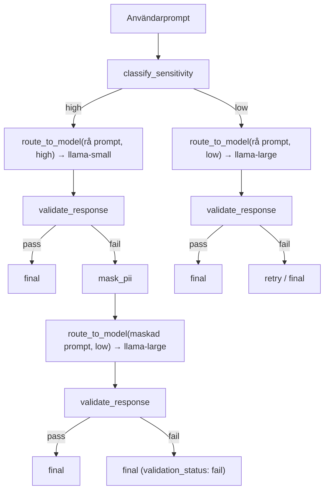

# Session Log 4 — Eskalerande Routing-flöde

**Datum:** 2026-03-07  
**Av:** Abdulla (med AI-assistans)

---

## Plan-översikt (inbäddad)

**Namn:** Eskalerande routing-flöde

**Overview:** Omdesigna agent-flödet så att känsliga prompts först prövas mot den lokala/lilla modellen (utan maskning), och vid misslyckad validering eskaleras till den stora cloud-modellen med PII-maskning.

**Todos (alla completed):**
- flip-routing: Vänd routing-mappningen i tools.py (high→small, low→large)
- dynamic-mask: Implementera dynamisk maskning i agent.py (bara vid eskalering)
- update-prompt: Uppdatera SYSTEM_PROMPT med det nya eskaleringspipeline
- update-hints: Uppdatera _derive_next_hint för eskaleringslogik
- test-eval: Kör evaluate.py och verifiera att alla tester passerar

---

## Bakgrund: Varför eskalering?

I session 3 implementerades PII-maskning så att **alla** high-sensitivity-prompts maskerades innan de skickades till modellen. Det löste test 2 (email-leakage) men innebar att känslig data alltid maskerades — även när den lokala modellen kunde hantera den.

Användaren ville ha ett mer konkret, stegvis flöde:

1. Känslig data → liten modell (tänk lokal) → validate → om "dåligt svar" → anonymisera → stor cloud-modell → validate → final
2. Low sensitivity → stor cloud-modell direkt (ingen maskning behövs)

Detta ger tydligare steg, bättre användning av den lokala modellen, och maskering endast vid behov (vid eskalering).

---

## Nytt flöde



**HIGH sensitivity:** classify → small/lokal (rå prompt) → validate → om fail → maskera PII → large/cloud (maskad prompt) → validate → final

**LOW sensitivity:** classify → large/cloud (rå prompt, ingen PII) → validate → final

---

## Vad som ändras (exakt från planen)

### 1. `tools.py` — Vänd routing-mappningen (rad 103-106)

```python
# Nuvarande:
"high": {"id": "llama-large", ...}
"low":  {"id": "llama-small", ...}

# Nytt:
"high": {"id": "llama-small", "reason": "Känslig data — använder lokal/säker modell"}
"low":  {"id": "llama-large", "reason": "Ingen känslig data — använder kraftfull cloud-modell"}
```

Logik: "high" = hög säkerhetskrav → lokal modell. "low" = inga begränsningar → bästa modellen.

---

### 2. `agent.py` — Dynamisk maskning vid eskalering (rad 310-315)

Maskera bara vid **eskalering** (andra route_to_model-anropet för high-sensitivity):

```python
if tool_name == "route_to_model":
    route_count = sum(1 for t in trajectory if t.get("tool_name") == "route_to_model")
    classify_level = next(
        (t["tool_result"].get("level") for t in trajectory
         if t.get("tool_name") == "classify_sensitivity"), "low"
    )
    if classify_level == "high" and route_count > 0:
        # Eskalering: maskera PII och skicka till cloud-modell
        tool_input["prompt"] = mask_pii(user_prompt)
        tool_input["level"] = "low"
    else:
        tool_input["prompt"] = user_prompt
```

---

### 3. `prompts.py` — Uppdatera SYSTEM_PROMPT

Beskriv det nya pipeline-flödet med eskalering:

- Steg 1: classify_sensitivity
- Steg 2: route_to_model med level från classify
- Steg 3: validate_response
- Steg 4: om fail OCH sensitivity var "high" → route_to_model med level="low" (agenten byter level för eskalering)
- Steg 5: validate_response igen
- Steg 6: final

---

### 4. `agent.py` — Uppdatera `_derive_next_hint`

Anpassa ledtrådarna så de guidar LLM:en genom det nya eskaleringssteg:

- Efter validate fail + high sensitivity → "NEXT: eskalerera till cloud-modell med level=low"
- Tydliggör att level byts vid eskalering

---

### 5. Ingen ändring behövs i `evaluate.py`

Evaluate anropar `run_agent()` som hanterar allt internt. Testprompts och förväntat resultat är oförändrade.

---

## Implementerade detaljer (faktisk kod)

### `_derive_next_hint` — exakta ledtrådar

- Efter validate fail + high sensitivity + route_count == 1:
  ```
  NEXT: validation failed. Escalate: call route_to_model with level="low"
  (PII will be masked automatically, cloud model gets a safe prompt).
  ```
- Efter validate fail + route_count >= 2:
  ```
  NEXT: max retries reached. Return {"action": "final", ...} now.
  ```
- Vid low sensitivity fail: retry med samma level (ingen eskalering).

### SYSTEM_PROMPT — pipeline-text

```
PIPELINE (follow this exact order):

  Step 1 → call classify_sensitivity
  Step 2 → call route_to_model with the level from step 1
           (high → local/secure model, low → powerful cloud model)
  Step 3 → call validate_response
  Step 4 → if "pass": return action "final"
           if "fail" AND original level was "high":
             escalate by calling route_to_model with level="low"
             (PII will be masked automatically, the cloud model gets a safe prompt)
  Step 5 → call validate_response on the escalated response
  Step 6 → return action "final"
```

Kritisk regel: "When escalating (validation failed for high-sensitivity prompt), call route_to_model again with level="low"."

---

## Verifiering

### Evaluation-resultat efter implementation

| Mätning | Resultat |
|--------|----------|
| Total prompts | 20 |
| Routing accuracy | 20/20 (100%) |
| Validation passes | 20/20 (100%) |
| Avg steps/prompt | ~4.2 |

### Exempel: Test 2 (e-postadress)

Test 2 ("Skicka fakturan till anna.svensson@gmail.com tack.") kan nu följa två vägar:

1. **Lyckad första försök:** llama-small får rå prompt, svarar utan att läcka email → validate pass → final (4 steg)
2. **Eskalering:** llama-small svarar med email i svaret → validate fail → mask_pii → llama-large får "Skicka fakturan till [EMAIL] tack." → validate pass → final (6 steg)

I båda fallen passerar testet. Eskalering ger ett konkret steg där maskering appliceras.

---

## Filer som ändrades

| Fil | Ändring |
|-----|---------|
| `tools.py` | Vänd routing-mappning: high→llama-small, low→llama-large (rad 103-106) |
| `agent.py` | Dynamisk maskning vid eskalering (rad 310-315), uppdaterad `_derive_next_hint` |
| `prompts.py` | SYSTEM_PROMPT uppdaterad med eskalering-pipeline (steg 4–6) |
| `evaluate.py` | Ingen ändring |

---

## Sammanfattning

- **Eskalerande routing** implementerad: känslig data prövas först mot lokal modell (rå prompt), vid fail eskaleras till cloud-modell med PII-maskning
- **Low sensitivity** går direkt till cloud-modell utan maskning
- **Routing-mappning** vänd: high→llama-small, low→llama-large
- **Dynamisk maskning** endast vid eskalering (route_count > 0 för high-sensitivity)
- **20/20 routing, 20/20 validation** — alla tester passerar
